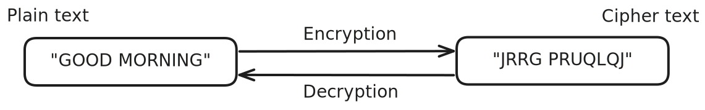

# Introduction to Cryptography

**Cryptography** is the process of hiding information such that no one except the recipient is able to know what information is being conveyed. In other words, it is practice and study of techniques for secure communication in presence of adversarial behavior. Further cryptographic schemes can be categorized in to 2 main categories which is Symmetric key based encryption or Asymmetric key based encryption.

## Basic Terminology

### Plain Text

**Plain Text** or **Original Text** or **Message** is nothing but a sequence of characters that are unformatted and may represent a part of file or something else. It is data that basically conveys some meaning. For example, "Good Morning", "Pay me $20", "I have to visit Temple", etc. This data can be in any format such as ASCII, Decimal, Binary, Hexadecimal etc and it can be of any length.

### Cipher Text

**Cipher Text** or **Encrypted Text** is a sequence of characters that are unintelligible and does not covey any meaning. They are a clump of gibbersh text when seen by someone who does not know that it has been converted from a plain text using an encryption algorithm.

### Encryption

**Encryption** is a process of converting plain text data to cipher text data by means of substitution, transposition, or a combination of both, in order to protect the confidentiality of the information.

### Decryption

**Decryption** is the process of converting cipher text data back into its original plain text form using a specific key or algorithm, in order to retrieve the original information and ensure its readability by authorized users.

### Adversary

**Adversary** refers to any entity—such as a person, group, or system that aims to gain unauthorized access to, disrupt, or compromise the confidentiality or integrity of the Message.

## References

- [Wikipedia - Cryptography](https://en.wikipedia.org/wiki/Cryptography)
