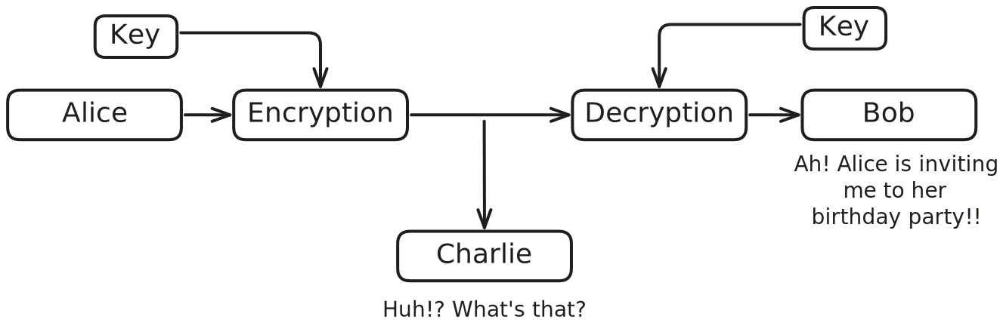
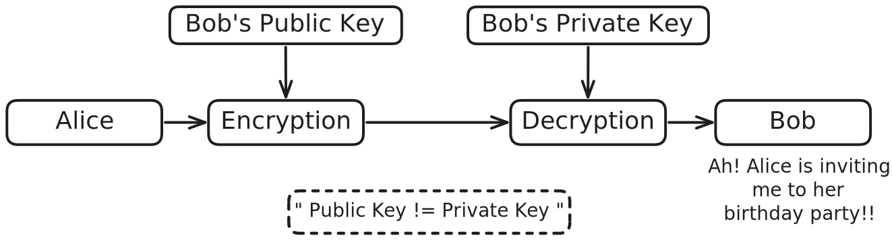

# Symmetric & Asymmetric Key Cryptography

In cryptography, Symmetric and Asymmetric Key Cryptography are two fundamental techniques used to secure communication by encrypting and decrypting data. Each method has its own approach to handling secret keys and plays a vital role in protecting information.

## Symmetric Key Cryptography

**Symmetric Key Cryptography**, also known as **Private Key Cryptography**, is a method of cryptography where the same key is used for both encrypting plain text and decrypting cipher text at the sender and receiver ends, respectively.

- The same key is shared among two or more parties.
- A major challenge is securely sharing the key, but there are established methods to address this issue.
- Symmetric ciphers are generally faster and more efficient than their counterparts (asymmetric ciphers).
- They make use of either [Stream Ciphers](cryptography/stream.md) or [Block Ciphers](cryptography/block.md).

**Example:** Alice, Bob, and Charlie are members of a group chat. Alice wants to invite Bob to her birthday party without Charlie knowing. However, all three are together at all times. If Alice and Bob share a secret key that Charlie doesn’t know, Alice can encrypt the invitation using that key and send it in the group chat. When Bob receives the encrypted message, he can use the shared key to decrypt it—while Charlie remains unaware of its content.

## Asymmetric Key Cryptography

**Asymmetric Key Cryptography**, also known as **Public Key Cryptography**, is a method of cryptography that uses a pair of keys—one public and one private. The public key is used to encrypt data, while the private key is used to decrypt it or vice-versa.

- Each party has a public key (shared openly) and a private key (kept secret).
- There’s no need to share private keys, which solves the secure key distribution problem.
- Asymmetric encryption is more secure for key exchange but generally slower than symmetric encryption.
- Common algorithms include RSA, ECC, and ElGamal.

**Example:** Alice wants to send a confidential message to Bob. She uses Bob’s **public key** to encrypt the message. Once encrypted, the message can only be decrypted using Bob’s **private key**, which only he possesses. Even if Charlie intercepts the message, he won't be able to read it because he doesn't have Bob’s private key.

## References

- [Wikipedia - Symmetric-Key Algorithm](https://en.wikipedia.org/wiki/Symmetric-key_algorithm)
- [Wikipedia - Asymmetric-Key Algorithm](https://en.wikipedia.org/wiki/Public-key_cryptography)
