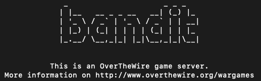
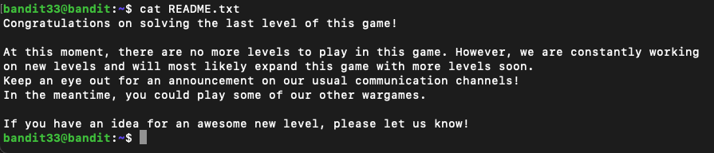

# Bandit - Level Beginner



The **Bandit wargame** is aimed at absolute beginners. It will teach the basics needed to be able to play other wargames.

**Official Website:** [OverTheWire - Bandit](https://overthewire.org/wargames/bandit/)

> **Note:** Please don't copy or jump to solutions. This page is designed for people who are not able to figure it out even after spending quite a lot of time.

> **AI WARNING:** AI has not been used to solved any of the level however, It has been used to format and rewrite my description to a professional tone and spellcheck.

## Level 0

**Goal:** Login to the ssh server `bandit.labs.overthewire.org` on port `2220`. The username is `bandit0` and password is `bandit0`

To solve this level, I connected to the SSH server using the provided username, password, and port with the following command:

```bash
ssh bandit0@bandit.labs.overthewire.org -p 2220
```

After successfully logging in, I located the `readme` file in the user’s home directory, which contained the password for level 1.

## Level 1

**Goal:** The password for the next level is stored in a file called `-` located in the home directory

This level is straightforward. To open the file named `-`, it is necessary to specify the entire path. Using the following command, I retrieved the password for level 2:

```bash
cat ./-
```

## Level 2

**Goal:** The password for the next level is stored in a file called `spaces in this filename` located in the home directory

I discovered two methods to solve this challenge. First, by directing Linux to display the contents of all files using a wildcard. Second, by escaping the spaces in the filename with backslashes. Using either approach, I obtained the password for level 3:

```bash
cat ./*
cat ./spaces\ in\ this\ filename
```

## Level 3

**Goal:** The password for the next level is stored in a `hidden file` in the `inhere` directory.

Upon logging in, I noticed a directory named `inhere` in the home directory, which initially appeared empty. To reveal hidden files, I used the `ll` command, which displayed a hidden file named `..Hiding-From-You`. Reading this file provided the password for level 4:

```bash
ll
cat ./...Hiding-From-You
```

## Level 4

**Goal:** The password for the next level is stored in the **only** `human-readable` file in the `inhere` directory.

Initially, I attempted to print all the files, but most contained binary data except for one. Although I found a password, I realized this was not the intended method. After reviewing the level description, I used the `man` command to understand the suggested commands. Among them, the `file` command, described as `determine file type` stood out. Using the file command on all files `./*` in the `inhere` directory, I identified the file containing human-readable ASCII text. Reading this file revealed the password for level 5:

```bash
man file
cd inhere
file ./*
cat ./-file07
```

## Level 5

**Goal:** The password for the next level is stored in a file **somewhere** under the `inhere` directory and has all of the following properties:

- human-readable
- 1033 bytes in size
- not executable

The `inhere` directory contained multiple subdirectories, which required some time to explore. I studied the `man` page for the `find` command to understand how to search by file size. Eventually, I used the following command to locate the file with the specified size and retrieve the password:

```bash
find -size 1033c    # Note: 'c' specifies size in bytes (characters), not blocks.
ll ./maybehere07/.file2     # To verify the file’s size and permissions
cat ./maybehere07/.file2
```

## Level 6

**Goal:** The password for the next level is stored **somewhere on the server** and has all of the following properties:

- owned by user `bandit7`
- owned by group `bandit6`
- 33 bytes in size

I consulted the `man` pages for the find command again and constructed the following command. Although it produced a lot of output, it included the file path containing the password for the next level:

```bash
find ../../ -size 33c -user bandit7 -group bandit6
cat ../../var/lib/dpkg/info/bandit7.password
```

## Level 7

**Goal:** The password for the next level is stored in the file `data.txt` next to the word `millionth`

To determine the number of words, I used the `wc -w` command. Then, by combining `cat` with `grep`, I searched for the keyword `millionth` which revealed the password for the next level:

```bash
cat data.txt | grep "millionth"
```

## Level 8

**Goal:** The password for the next level is stored in the file `data.txt` and is the only line of text that **occurs only once**.

Using the `whatis` command, I explored the functions of the suggested commands `sort` and `uniq`. The sort command arranges all lines in alphabetical (A-Z) order, while `uniq` filters out adjacent duplicate lines, returning only unique lines. To solve the challenge, I combined these commands by sorting the data first and then applying uniq. Additionally, I used the `-u` and `-c` flags for different outputs:

```bash
sort data.txt | uniq -u     # Outputs only unique lines
sort data.txt | uniq -c     # Counts occurrences of each line
```

## Level 9

**Goal:** The password for the next level is stored in the file `data.txt` in one of the few human-readable strings, preceded by several `=` characters.

From the given suggested commands, I used `whatis` commad on `strings` and it informed me that it print the sequences of printable characters in files. We I got the solution as now I can do the `grep` on the output.

```bash
strings data.txt | grep "=="
```

## Level 10

**Goal:** The password for the next level is stored in the file `data.txt`, which contains **base64 encoded data**

Using the `whatis` command, I learned that strings prints sequences of printable characters within files. With this understanding, I applied `grep` to filter the output, which led me to the solution:

```bash
base64 -d data.txt
```

## Level 11

**Goal:** The password for the next level is stored in the file `data.txt`, where all lowercase (a-z) and uppercase (A-Z) letters have been rotated by `13 positions`.

This challenge resembled a `Caesar cipher` with a key of `13`. Using the `whatis` command, I investigated the unfamiliar `tr` command and discovered that it `translates characters`. By applying this, I was able to replace each letter with its counterpart 13 positions ahead in the alphabet, effectively decoding the text:

```bash
cat data.txt | tr [a-z] [n-za-m] | tr [A-Z] [N-ZA-M]
```

The previous solution was my initial approach, but I later discovered a more concise method. Although less visually clear, this compact command achieves the same result effectively:

```bash
cat data.txt | tr [a-zA-Z] [n-za-mN-ZA-M]
```

## Level 12

**Goal:** The password for the next level is stored in the file `data.txt`, which is a `hexdump` of a file that has been repeatedly compressed. For this level it may be useful to create a directory under `/tmp` in which you can work. Use mkdir with a hard to guess directory name. Or better, use the command `mktemp -d`. Then copy the datafile using `cp`, and rename it using `mv`

First, I created a temporary directory, copied the file there, and navigated to it. Since the file was `hex-dumped`, I needed to `reverse` it. After reviewing the suggested commands, I used `whatis` and man on `xxd` to reverse the hex dump. Then, I used the `file` command to identify the file type, which indicated compression.

Following this, I explored the `gzip` command for decompression using its `man` page and ran `gunzip`. The `file` command then suggested the file was compressed with `bzip2`, so I used `whatis` and `man` for `bzip2` and decompressed accordingly. Subsequently, the file was a `tar` archive, so I extracted it using `tar`.

This process was repeated multiple times—alternating between `gzip`, `bzip2`, and `tar`—until the final decompressed file was obtained. Below is the command sequence demonstrating the steps taken:

```bash
mktemp -d
cp data.txt /tmp/tmp.COBhrxOjPS/data.txt
cd /tmp/tmp.COBhrxOjPS
xxd -r data.txt temp.txt
file temp.txt
cp temp.txt tmp1.z
gunzip tmp1.z
file tmp1
mv tmp1 tmp1.bz
bunzip2 tmp1.bz
file tmp1
mv temp.txt tmp1.z
gunzip tmp1.z
file tmp1
mv tmp1 tmp1.tar
tar -xf tmp1.tar
file data5.bin
mv data5.bin tmp2.tar
tar -xf tmp2.tar
file data6.bin
rm tmp1.tar tmp2.tar
file data6.bin
mv data6.bin tmp1.bz
bunzip tmp1.bz
bunzip2 tmp1.bz
file tmp1
mv tmp1 tmp1.tar
tar -xf tmp1.tar
file data8.bin
rm tmp1.tar
mv data8.bin tmp1.z
gunzip tmp1.z
file tmp1
```

## Level 13

**Goal:** The password for the next level is stored in `/etc/bandit_pass/bandit14` and can only be read by user `bandit14`. For this level, you don’t get the next password, but you get a `private SSH key` that can be used to log into the next level.

I obtained the private key required to log in to the `bandit14` account. To understand how to use a private key with the `ssh` command, I referred to the `man` page for `ssh`. There, I learned how to specify a private key file using the `-i` option. I then logged in and retrieved the password for the next level:

```bash
ssh bandit14@bandit.labs.overthewire.org -p 2220 -i sshkey.private
cat /etc/bandit_pass/bandit14
```

## Level 14

**Goal:** The password for the next level can be retrieved by submitting the password of the current level to port `30000` on `localhost`.

From my understanding, I needed to make a `POST` request to `localhost:30000` using the current password to retrieve the next level’s password. I used the `nc` (netcat) command—after reviewing its `man` page—to send a test string to the specified address and port. The response "Wrong Answer" confirmed that the correct approach was to replace the string "Hello" with the actual password:

```bash
echo "Hello" | nc localhost 30000
```

## Level 15

**Goal:** The password for the next level can be retrieved by submitting the password of the current level to port `30001` on `localhost` using `SSL/TLS encryption`.

The provided hint suggested looking into `CONNECTED COMMANDS` though it wasn't immediately clear where. After reviewing the `man` pages for the suggested commands, I discovered openssl `s_client`, which is used to establish `SSL/TLS` connections. Using this command, I was able to connect to the specified port and retrieve the password by manually pasting the current one:

```bash
openssl s_client -connect localhost:30001   # Open Connection and paste the password.
```

## Level 16

**Goal:** The credentials for the next level can be retrieved by submitting the password of the current level to a port on `localhost` in the range **31000 to 32000**. First find out which of these ports have a server listening on them. Then find out which of those speak `SSL/TLS` and which don’t. There is only `1 server` that will give the next credentials, the others will simply send back to you whatever you send to it.

To identify which ports were actively listening, I used `nmap` for a quick scan. It returned `five` open ports, which I tested individually. I discovered that the server on port `31790` was the correct one for retrieving the password.

Initially, I encountered a `KeyUpdate Interactive` issue when connecting. I resolved this by adding the `-quiet` flag to the openssl `s_client` command. This successfully returned the private key:

```bash
openssl s_client -connect localhost:31790 -quiet
```

## Level 17

**Goal:** There are 2 files in the homedirectory: `passwords.old` and `passwords.new`. The password for the next level is in `passwords.new` and is the only line that has been changed between `passwords.old` and `passwords.new`

The goal here was to identify the difference between two files. This was straightforward—using the `diff` command, I was able to compare the files and retrieve the updated password:

```bash
diff passwords.old passwords.new
```

## Level 18

**Goal:** The password for the next level is stored in a file `readme` in the homedirectory. Unfortunately, someone has modified `.bashrc` to log you out when you log in with `SSH`.

This challenge required logging in via `SSH` using a different shell. I spent considerable time exploring the ssh man pages but eventually resorted to a quick web search to find the solution. By using the `-t` flag, I was able to `force pseudo-terminal allocation` and launch a different shell (sh), which allowed me to access the `readme` file:

```bash
ssh bandit18@bandit.labs.overthewire.org -p 2220 -t sh
cat readme
```

## Level 19

**Goal:** To gain access to the next level, you should use the `setuid binary` in the homedirectory. Execute it without arguments to find out how to use it. The password for this level can be found in the usual place (`/etc/bandit_pass`), after you have used the `setuid binary`.

The provided binary is configured to execute commands with the `UID` of the `bandit20` user, essentially granting temporary `elevated privileges`. If you're familiar with concepts like `UID`, `SUID`, and `GUID`, this becomes a straightforward task. I used the binary to run a `cat` command, which revealed the password:

```bash
./bandit20-do cat /etc/bandit_pass/bandit20
```

## Level 20

**Goal:** There is a `setuid binary` in the homedirectory that does the following: it makes a connection to `localhost` on the port you specify as a commandline argument. It then reads a line of text from the connection and compares it to the password in the previous level (`bandit20`). If the password is correct, it will transmit the password for the next level (`bandit21`).

It took some time to fully understand the objective, but I was able to solve it without any external help. The task was to start a server that serves the current level's password. To achieve this, I used `nc` (netcat) in listening mode to serve the password, then connected to it using the provided binary:

```bash
echo "0qXahG8ZjOVMN9Ghs7iOWsCfZyXOUbYO" | nc -l 2323 &  # Run in backgound
./suconnect 2323
```

## Level 21

**Goal:** A program is running automatically at regular intervals from cron, the time-based job scheduler. Look in `/etc/cron.d/` for the configuration and see what command is being executed.

As suggested in the level objective, I navigated to the `/etc/cron.d` directory and reviewed the cron jobs present. There, I found a file related to `bandit22`, the next level. Inspecting its contents led me to a corresponding bash script, which revealed that it periodically copies the password for the next level to a file in the `/tmp` directory. From there, retrieving the password was straightforward:

```bash
cd /etc/cron.d
ls -la
cat cronjob_bandit22
cd /usr/bin
ls | grep bandit
cat cronjob_bandit22.sh
cat /tmp/t7O6lds9S0RqQh9aMcz6ShpAoZKF7fgv
```

## Level 22

**Goal:** A program is running automatically at regular intervals from cron, the time-based job scheduler. Look in `/etc/cron.d/` for the configuration and see what command is being executed.

This level was quite similar to the previous one, but with an added challenge: instead of directly accessing the password file, I needed to analyze the script to determine the dynamically generated filename. After reviewing the cron job and its associated script, I found that it created the filename using an `MD5` hash of a specific string. Once I computed the hash and located the corresponding file in `/tmp`, I was able to retrieve the password:

```bash
cd /etc/cron.d
cat cronjob_bandit23
cat /usr/bin/cronjob_bandit23.sh
echo "I am user bandit23" | md5sum | cut -d ' ' -f 1
cat /tmp/8ca319486bfbbc3663ea0fbe81326349
```

## Level 23

**Goal:** A program is running automatically at regular intervals from cron, the time-based job scheduler. Look in `/etc/cron.d/` for the configuration and see what command is being executed.

This level was similar to the previous two but introduced a new challenge. There was a script that executed all scripts in a specific folder as the user `bandit24`. This allowed me to create and place a custom script in that folder to extract the password for `bandit24`.

Initially, I struggled with permissions in my temporary directory, which prevented the script from running correctly until I adjusted them. After resolving the permission issues, I copied my script into the target directory and waited for it to execute:

```bash
cd /etc/cron.d
cat cronjob_bandit24
cat /usr/bin/cronjob_bandit24.sh
mktemp -d
cd /tmp/tmp.EmlSrC8cBt
vim get_pass.sh
chmod 777 get_pass.sh
touch bandit24
chmod 777 bandit24
chmod 777 /tmp/tmp.EmlSrC8cBt   # Adjusted permissions after troubleshooting why the script was not running
cp ./get_pass.sh /var/spool/bandit24/foo     # Waited about a minute for execution
```

The `get_pass.sh` script content:

```bash
#!/bin/bash
cat /etc/bandit_pass/bandit24 >> /tmp/tmp.EmlSrC8cBt/bandit24
```

## Level 24

**Goal:** A daemon is listening on port `30002` and will give you the password for `bandit25` if given the password for `bandit24` and a `secret numeric 4-digit pincode`. There is no way to retrieve the pincode except by going through all of the `10000 combinations`, called **brute-forcing**.

Before proceeding, I connected to the provided daemon and discovered that it required a `password PIN pair`. To automate this, I created a script that generates all possible `4-digit PIN combinations` paired with the password, saving them to an input file. I then piped this input to the `daemon` via `nc` and redirected the output to a file. Using `sort -u`, I filtered the unique outputs to find the password:

```bash
nc localhost 30002
mktemp -d
cd /tmp/tmp.Z57jwXJsYU
vim test.sh
touch input.txt
bash test.sh
cat input.txt | nc localhost 30002 >> output.txt
sort -u output.txt
```

The script used to generate the input file is as follows:

```bash
#!/bin/bash
for i in {0..9}
do
        for j in {0..9}
        do
                for k in {0..9}
                do
                        for l in {0..9}
                        do
                                echo "gb8KRRCsshuZXI0tUuR6ypOFjiZbf3G8 $i$j$k$l" > input.txt
                        done
                done
        done
done
```

## Level 25

**Goal:** Logging in to `bandit26` from `bandit25` should be fairly easy… The shell for user `bandit26` is not `/bin/bash`, but something else. Find out what it is, how it works and how to break out of it.

Upon logging in, I was provided with the `SSH private key` for user `bandit26`. To identify the user’s default shell, I examined the `/etc/passwd` file. The default shell is indicated as the last field in each line, which in this case is `/usr/bin/showtext`. Upon further inspection, I found that this shell invokes the more command.

To exploit this behavior, I resized my terminal window to a very small height, which triggered a vulnerability due to how more handles terminal dimensions. For this step, I referred to an external [hint](https://mayadevbe.me/posts/overthewire/bandit/level26/)

```bash
cat /etc/passwd
ls -la /usr/bin/showtext
cat /usr/bin/showtext
exit    # Resize terminal window to very small height, as 'more' is used
ssh bandit26@bandit.labs.overthewire.org -p 2220 -i test
(esc) :set shell=/bin/bash
(esc) :shell
cat /etc/bandit_pass/bandit26
```

Note: The test file above refers to the private key obtained in level 25, saved locally.

## Level 26

**Goal:** Good job getting a shell! Now hurry and grab the password for `bandit27`!

While already logged in, I utilized the provided binary executable to run commands with the privileges of user `bandit27`. Using this, I retrieved the password for `bandit27` with the following command:

```bash
./bandit27-do cat /etc/bandit_pass/bandit27
```

## Level 27

**Goal:** There is a git repository at `ssh://bandit27-git@localhost/home/bandit27-git/repo` via the port `2220`. The password for the user `bandit27-git` is the same as for the user `bandit27`. Clone the repository and find the password for the next level.

For this level, the task was simply to clone the repository. The key detail was how to specify the SSH port within the Git URL.

```bash
mktemp -d
cd /tmp/tmp.8sRbM8Geun
git clone ssh://bandit27-git@localhost:2220/home/bandit27-git/repo
cd repo
cat README
```

## Level 28

**Goal:** There is a git repository at `ssh://bandit28-git@localhost/home/bandit28-git/repo` via the port `2220`. The password for the user `bandit28-git` is the same as for the user `bandit28`. Clone the repository and find the password for the next level.

Although the objective was similar to the previous level, the password was not found in the current repository files. I suspected it might be located in an earlier commit. Using basic Git commands, I located the password as follows:

```bash
mktemp -d
cd /tmp/tmp.me4AQ4Qlcy
git clone ssh://bandit28-git@localhost:2220/home/bandit28-git/repo
cd repo
cat README.md
git log
git checkout fb0df1358b1ff146f581651a84bae622353a71c0
cat README.md
```

## Level 29

**Goal:** There is a git repository at `ssh://bandit29-git@localhost/home/bandit29-git/repo` via the port `2220`. The password for the user `bandit29-git` is the same as for the user `bandit29`. Clone the repository and find the password for the next level.

The initial procedure was the same as the previous level. Upon inspection, the `README` indicated that the password was not present in the production branch, suggesting it might be located on a different branch.

```bash
mktemp -d
cd /tmp/tmp.M1nerAnJ8A
git clone ssh://bandit29-git@localhost:2220/home/bandit29-git/repo
cd repo
cat README.md
git branch -r      # Lists all remote branches.
git checkout origin/dev
cat README.md
```

## Level 30

**Goal:** There is a git repository at `ssh://bandit30-git@localhost/home/bandit30-git/repo` via the port `2220`. The password for the user `bandit30-git` is the same as for the user `bandit30`. Clone the repository and find the password for the next level.

Once again, I followed the usual steps. However, this time the `README` file was empty, with no remote branches or commits available. Instead, I discovered a Git tag which led me to the password.

```bash
mktemp -d
cd /tmp/tmp.Ihrmgf8585
git clone ssh://bandit30-git@localhost:2220/home/bandit30-git/repo
cd repo
cat README.md
git tag -l
git show secret
```

## Level 31

**Goal:** There is a git repository at `ssh://bandit31-git@localhost/home/bandit31-git/repo` via the port `2220`. The password for the user `bandit31-git` is the same as for the user `bandit31`. Clone the repository and find the password for the next level.

The process was quite repetitive. This time, I needed to create a file and commit it to the master branch.

```bash
mktemp -d
cd /tmp/tmp.72Iiy6gH8f
git clone ssh://bandit31-git@localhost:2220/home/bandit31-git/repo
cd repo
cat README.md
echo "May I come in?" > key.txt
vim .gitignore      # Remove the '*.txt' pattern, then save and exit
git add .
git commit -a -m "Key File"
git push origin master      # Although this will generate an error, the key will be revealed within the error message
```

## Level 32

**Goal:** After all this git stuff, it’s time for another escape. Good luck!

Finally, the Git challenges are behind me. I spent quite a bit of time on this level, but eventually needed to take a [hint](https://mayadevbe.me/posts/overthewire/bandit/level33/)

```bash
$0
ls -la
whoami
cat /etc/bandit_pass/bandit33
```

## Level 33

**Goal:** Game Ends Here!! We Did It :)



## Passwords

> Note: Password are changed periodically. They are latest as of Jun 07, 2025

- Level 1: `ZjLjTmM6FvvyRnrb2rfNWOZOTa6ip5If`
- Level 2: `263JGJPfgU6LtdEvgfWU1XP5yac29mFx`
- Level 3: `MNk8KNH3Usiio41PRUEoDFPqfxLPlSmx`
- Level 4: `2WmrDFRmJIq3IPxneAaMGhap0pFhF3NJ`
- Level 5: `4oQYVPkxZOOEOO5pTW81FB8j8lxXGUQw`
- Level 6: `HWasnPhtq9AVKe0dmk45nxy20cvUa6EG`
- Level 7: `morbNTDkSW6jIlUc0ymOdMaLnOlFVAaj`
- Level 8: `dfwvzFQi4mU0wfNbFOe9RoWskMLg7eEc`
- Level 9: `4CKMh1JI91bUIZZPXDqGanal4xvAg0JM`
- Level 10: `FGUW5ilLVJrxX9kMYMmlN4MgbpfMiqey`
- Level 11: `dtR173fZKb0RRsDFSGsg2RWnpNVj3qRr`
- Level 12: `7x16WNeHIi5YkIhWsfFIqoognUTyj9Q4`
- Level 13: `FO5dwFsc0cbaIiH0h8J2eUks2vdTDwAn`
- Level 14: `MU4VWeTyJk8ROof1qqmcBPaLh7lDCPvS`
- Level 15: `8xCjnmgoKbGLhHFAZlGE5Tmu4M2tKJQo`
- Level 16: `kSkvUpMQ7lBYyCM4GBPvCvT1BfWRy0Dx`
- Level 17: `EReVavePLFHtFlFsjn3hyzMlvSuSAcRD`
- Level 18: `x2gLTTjFwMOhQ8oWNbMN362QKxfRqGlO`
- Level 19: `cGWpMaKXVwDUNgPAVJbWYuGHVn9zl3j8`
- Level 20: `0qXahG8ZjOVMN9Ghs7iOWsCfZyXOUbYO`
- Level 21: `EeoULMCra2q0dSkYj561DX7s1CpBuOBt`
- Level 22: `tRae0UfB9v0UzbCdn9cY0gQnds9GF58Q`
- Level 23: `0Zf11ioIjMVN551jX3CmStKLYqjk54Ga`
- Level 24: `gb8KRRCsshuZXI0tUuR6ypOFjiZbf3G8`
- Level 25: `iCi86ttT4KSNe1armKiwbQNmB3YJP3q4`
- Level 26: `s0773xxkk0MXfdqOfPRVr9L3jJBUOgCZ`
- Level 27: `upsNCc7vzaRDx6oZC6GiR6ERwe1MowGB`
- Level 28: `Yz9IpL0sBcCeuG7m9uQFt8ZNpS4HZRcN`
- Level 29: `4pT1t5DENaYuqnqvadYs1oE4QLCdjmJ7`
- Level 30: `qp30ex3VLz5MDG1n91YowTv4Q8l7CDZL`
- Level 31: `fb5S2xb7bRyFmAvQYQGEqsbhVyJqhnDy`
- Level 32: `3O9RfhqyAlVBEZpVb6LYStshZoqoSx5K`
- Level 33: `tQdtbs5D5i2vJwkO8mEyYEyTL8izoeJ0`
